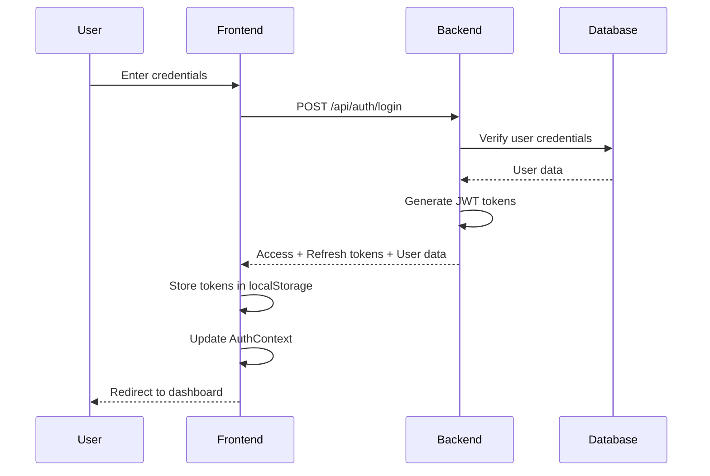
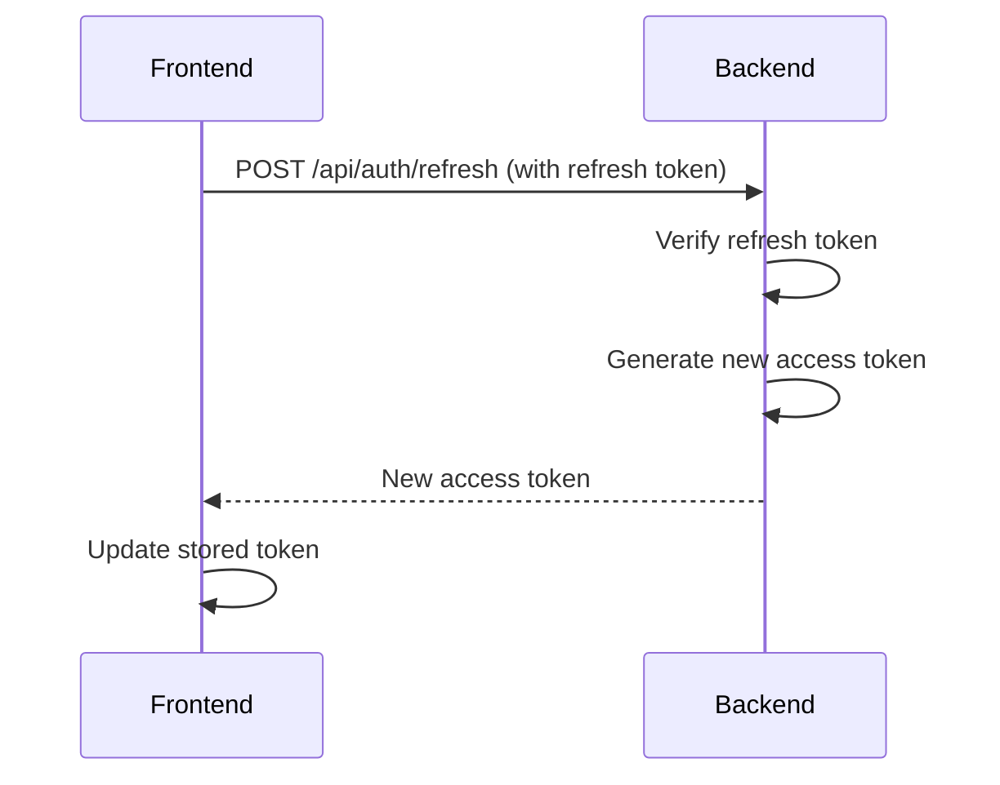
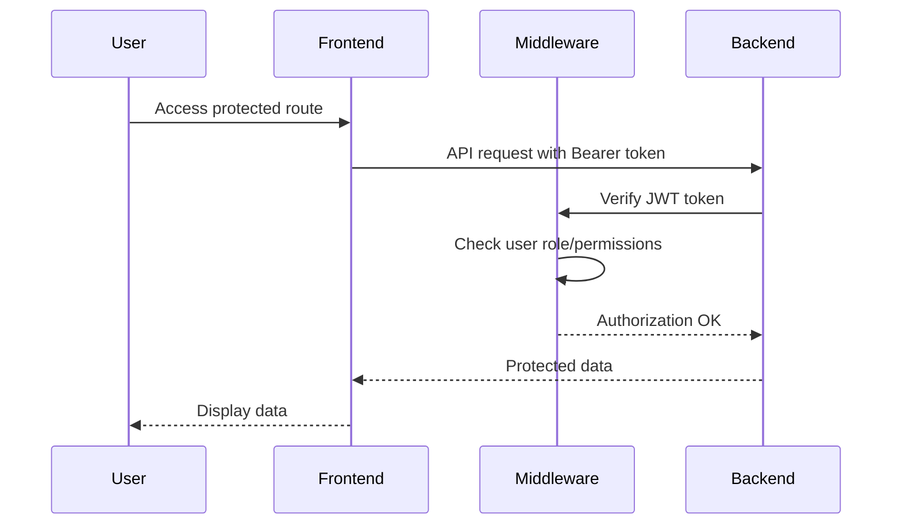

# Authentication & User Management API Documentation

## Table of Contents
1. [Overview](#overview)
2. [Authentication Flow](#authentication-flow)
3. [API Endpoints](#api-endpoints)
4. [Frontend Integration](#frontend-integration)
5. [Security Considerations](#security-considerations)

---

## Overview

This document describes the authentication and user management system for the Construction ERP application. The system uses JWT-based authentication with role-based access control (RBAC).

### Technology Stack
- **Backend**: Node.js + Express + MongoDB
- **Frontend**: React + React Query
- **Authentication**: JWT (JSON Web Tokens)
- **State Management**: React Context API + React Query

---

## Authentication Flow

### 1. Login Flow



### 2. Token Refresh Flow



### 3. Protected Route Access



---

## API Endpoints

### Authentication Endpoints

#### 1. Login
**Endpoint**: `POST /api/auth/login`

**Request Body**:
```json
{
  "email": "admin@erp.local",
  "password": "admin123"
}
```

**Response** (200 OK):
```json
{
  "success": true,
  "accessToken": "eyJhbGciOiJIUzI1NiIsInR5cCI6IkpXVCJ9...",
  "refreshToken": "eyJhbGciOiJIUzI1NiIsInR5cCI6IkpXVCJ9...",
  "user": {
    "id": "user-1",
    "name": "Admin User",
    "email": "admin@erp.local",
    "role": "Admin",
    "department": "Admin",
    "active": true
  }
}
```

**Error Response** (401 Unauthorized):
```json
{
  "success": false,
  "message": "Invalid email or password"
}
```

#### 2. Refresh Token
**Endpoint**: `POST /api/auth/refresh`

**Request Body**:
```json
{
  "refreshToken": "eyJhbGciOiJIUzI1NiIsInR5cCI6IkpXVCJ9..."
}
```

**Response** (200 OK):
```json
{
  "success": true,
  "accessToken": "eyJhbGciOiJIUzI1NiIsInR5cCI6IkpXVCJ9..."
}
```

---

### User Management Endpoints

All user management endpoints require authentication and Admin role.

#### 1. Get All Users
**Endpoint**: `GET /api/users`

**Headers**:
```
Authorization: Bearer <access_token>
```

**Response** (200 OK):
```json
{
  "success": true,
  "data": [
    {
      "id": "user-1",
      "name": "Admin User",
      "email": "admin@erp.local",
      "phone": "+91 98765 43210",
      "role": "Admin",
      "department": "Admin",
      "active": true,
      "createdAt": "2024-01-01T00:00:00.000Z",
      "updatedAt": "2024-01-01T00:00:00.000Z"
    }
  ]
}
```

#### 2. Get User by ID
**Endpoint**: `GET /api/users/:id`

**Headers**:
```
Authorization: Bearer <access_token>
```

**Response** (200 OK):
```json
{
  "success": true,
  "data": {
    "id": "user-1",
    "name": "Admin User",
    "email": "admin@erp.local",
    "phone": "+91 98765 43210",
    "role": "Admin",
    "department": "Admin",
    "active": true,
    "createdAt": "2024-01-01T00:00:00.000Z",
    "updatedAt": "2024-01-01T00:00:00.000Z"
  }
}
```

#### 3. Create User
**Endpoint**: `POST /api/users`

**Headers**:
```
Authorization: Bearer <access_token>
```

**Request Body**:
```json
{
  "name": "John Doe",
  "email": "john@erp.local",
  "password": "password123",
  "phone": "+91 9876543210",
  "role": "ProjectManager",
  "department": "Engineering",
  "permissions": []
}
```

**Response** (201 Created):
```json
{
  "success": true,
  "message": "User created successfully",
  "data": {
    "id": "user-123",
    "name": "John Doe",
    "email": "john@erp.local",
    "role": "ProjectManager",
    "department": "Engineering",
    "active": true,
    "createdAt": "2024-01-25T00:00:00.000Z"
  }
}
```

#### 4. Update User
**Endpoint**: `PUT /api/users/:id`

**Headers**:
```
Authorization: Bearer <access_token>
```

**Request Body** (all fields optional):
```json
{
  "name": "John Updated",
  "email": "john.updated@erp.local",
  "password": "newpassword123",
  "phone": "+91 9876543211",
  "role": "Approver",
  "department": "Admin",
  "active": false,
  "permissions": []
}
```

**Response** (200 OK):
```json
{
  "success": true,
  "message": "User updated successfully",
  "data": {
    "id": "user-123",
    "name": "John Updated",
    "email": "john.updated@erp.local",
    "role": "Approver",
    "department": "Admin",
    "active": false,
    "updatedAt": "2024-01-25T10:30:00.000Z"
  }
}
```

#### 5. Delete User
**Endpoint**: `DELETE /api/users/:id`

**Headers**:
```
Authorization: Bearer <access_token>
```

**Response** (200 OK):
```json
{
  "success": true,
  "message": "User deleted successfully"
}
```

---

### Profile Management Endpoints

#### 1. Get Current User Profile
**Endpoint**: `GET /api/profile`

**Headers**:
```
Authorization: Bearer <access_token>
```

**Response** (200 OK):
```json
{
  "success": true,
  "data": {
    "id": "user-1",
    "name": "Admin User",
    "email": "admin@erp.local",
    "phone": "+91 98765 43210",
    "role": "Admin",
    "department": "Admin",
    "avatarUrl": null,
    "active": true,
    "preferences": {
      "timezone": "Asia/Kolkata",
      "currency": "INR",
      "numberFormat": "short",
      "theme": "dark"
    }
  }
}
```

#### 2. Update Profile
**Endpoint**: `PUT /api/profile`

**Headers**:
```
Authorization: Bearer <access_token>
```

**Request Body**:
```json
{
  "name": "Updated Name",
  "phone": "+91 9999999999",
  "preferences": {
    "theme": "light",
    "currency": "USD"
  }
}
```

**Response** (200 OK):
```json
{
  "success": true,
  "message": "Profile updated successfully",
  "data": { ... }
}
```

#### 3. Change Password
**Endpoint**: `PUT /api/profile/password`

**Headers**:
```
Authorization: Bearer <access_token>
```

**Request Body**:
```json
{
  "currentPassword": "oldpassword123",
  "newPassword": "newpassword456"
}
```

**Response** (200 OK):
```json
{
  "success": true,
  "message": "Password changed successfully"
}
```

---

### Audit Trail Endpoints

#### 1. Get Audit Logs
**Endpoint**: `GET /api/audit-trail`

**Query Parameters** (all optional):
```
module: string (e.g., "Users", "Projects")
action: string (e.g., "Create", "Update", "Delete")
startDate: string (ISO 8601 date)
endDate: string (ISO 8601 date)
```

**Example**: `GET /api/audit-trail?module=Users&action=Create&startDate=2024-01-01`

**Headers**:
```
Authorization: Bearer <access_token>
```

**Response** (200 OK):
```json
{
  "success": true,
  "data": [
    {
      "id": "audit-1",
      "timestamp": "2024-01-25T10:30:00.000Z",
      "userId": "user-1",
      "userName": "Admin User",
      "action": "Create",
      "module": "Users",
      "entityType": "User",
      "entityId": "user-123",
      "entityCode": "john@erp.local",
      "details": "Created new user: John Doe",
      "ipAddress": "192.168.1.1"
    }
  ]
}
```

#### 2. Get Audit Log by ID
**Endpoint**: `GET /api/audit-trail/:id`

**Headers**:
```
Authorization: Bearer <access_token>
```

**Response** (200 OK):
```json
{
  "success": true,
  "data": {
    "id": "audit-1",
    "timestamp": "2024-01-25T10:30:00.000Z",
    "userId": "user-1",
    "userName": "Admin User",
    "action": "Create",
    "module": "Users",
    "entityType": "User",
    "entityId": "user-123",
    "entityCode": "john@erp.local",
    "details": "Created new user: John Doe",
    "ipAddress": "192.168.1.1",
    "userAgent": "Mozilla/5.0..."
  }
}
```

---

## Frontend Integration

### 1. AuthContext Setup

The authentication state is managed globally using React Context:

**Location**: `src/contexts/AuthContext.tsx`

```typescript
interface AuthContextType {
  user: User | null;
  token: string | null;
  isAuthenticated: boolean;
  isLoading: boolean;
  login: (credentials: LoginCredentials) => Promise<void>;
  logout: () => void;
}
```

**Usage**:
```typescript
import { useAuth } from '@/contexts/AuthContext';

function MyComponent() {
  const { user, isAuthenticated, logout } = useAuth();
  
  if (!isAuthenticated) {
    return <div>Please log in</div>;
  }
  
  return <div>Welcome, {user?.name}!</div>;
}
```

### 2. React Query Hooks

#### User Management Hooks

**Location**: `src/lib/hooks/useUsers.ts`

```typescript
// Get all users
const { data: users, isLoading } = useUsers();

// Get single user
const { data: user } = useUser(userId);

// Create user
const createUser = useCreateUser();
await createUser.mutateAsync(userData);

// Update user
const updateUser = useUpdateUser();
await updateUser.mutateAsync({ id: userId, data: userData });

// Delete user
const deleteUser = useDeleteUser();
await deleteUser.mutateAsync(userId);
```

#### Profile Hooks

**Location**: `src/lib/hooks/useProfile.ts`

```typescript
// Get profile
const { data: profile } = useProfile();

// Update profile
const updateProfile = useUpdateProfile();
await updateProfile.mutateAsync(profileData);

// Change password
const changePassword = useChangePassword();
await changePassword.mutateAsync({
  currentPassword: 'old',
  newPassword: 'new'
});
```

#### Audit Trail Hooks

**Location**: `src/lib/hooks/useAudit.ts`

```typescript
// Get audit trail with filters
const { data: auditLogs } = useAuditTrail({
  module: 'Users',
  action: 'Create',
  startDate: '2024-01-01'
});

// Get single audit entry
const { data: auditEntry } = useAuditEntry(auditId);
```

### 3. API Utilities

All API calls use a centralized `apiCall` function that:
- Automatically includes the JWT token
- Handles response formatting
- Throws errors for failed requests

**Example** (`src/lib/api/userApi.ts`):
```typescript
async function apiCall(endpoint: string, options?: RequestInit) {
  const token = localStorage.getItem('erp_auth_token');
  const response = await fetch(`${API_URL}${endpoint}`, {
    ...options,
    headers: {
      'Content-Type': 'application/json',
      'Authorization': token ? `Bearer ${token}` : '',
      ...options?.headers,
    },
  });

  const result = await response.json();
  
  if (!response.ok || !result.success) {
    throw new Error(result.message || 'Request failed');
  }
  
  return result;
}
```

### 4. Protected Routes

Routes are protected using the authentication state:

```typescript
<Route
  path="/admin"
  element={
    isAuthenticated ? (
      <Admin />
    ) : (
      <Navigate to="/login" replace />
    )
  }
/>
```

---

## Security Considerations

### 1. Token Storage
- **Access Token**: Stored in `localStorage` with key `erp_auth_token`
- **Refresh Token**: Stored in `localStorage` with key `erp_refresh_token`
- **User Data**: Stored in `localStorage` with key `erp_user`

### 2. Token Expiry
- Access tokens expire in **15 minutes** (configurable via `JWT_EXPIRE`)
- Refresh tokens have a longer lifetime (configurable via backend)
- Frontend should implement token refresh logic before access token expires

### 3. Password Security
- Minimum length: 6 characters
- Passwords are hashed using bcrypt (10 rounds)
- Never logged or exposed in API responses

### 4. Role-Based Access Control (RBAC)

**Available Roles**:
- `Admin`: Full system access
- `ProjectManager`: Project and engineering module access
- `PurchaseOfficer`: Purchase module access
- `SiteEngineer`: Site management access
- `Accountant`: Accounts module access
- `Approver`: Approval workflows
- `Viewer`: Read-only access

**Middleware**:
```javascript
// Protect route - requires valid JWT
app.use('/api/users', protect);

// Authorize specific roles
app.use('/api/users', authorize('Admin'));
```

### 5. Input Validation
- All inputs validated using Zod schemas on frontend
- Server-side validation on all endpoints
- Email format validation
- Phone number format validation (10 digits)

### 6. CORS Configuration
- Frontend URL: Configured via `FRONTEND_URL` environment variable
- Only specified origins allowed to make requests

### 7. Audit Trail
- All user actions logged automatically
- Includes: userId, action, module, entity details, IP address, timestamp
- Cannot be modified or deleted by regular users

---

## Environment Variables

### Backend (.env)
```bash
# Server
PORT=5005
NODE_ENV=development

# Database
MONGODB_URI=mongodb://127.0.0.1:27017/construction_erp_db

# JWT Auth
JWT_SECRET=your_super_secret_jwt_key_change_in_production_min_32_chars
JWT_REFRESH_SECRET=your_refresh_secret_key_change_in_production
JWT_EXPIRE=15m

# CORS + Frontend
FRONTEND_URL=http://localhost:8080
```

### Frontend (.env)
```bash
VITE_API_URL=http://localhost:5005/api
```

---

## Error Handling

### Common Error Responses

#### 400 Bad Request
```json
{
  "success": false,
  "message": "Name, email, password, and role are required."
}
```

#### 401 Unauthorized
```json
{
  "success": false,
  "message": "Not authorized to access this route"
}
```

#### 403 Forbidden
```json
{
  "success": false,
  "message": "You do not have permission to perform this action"
}
```

#### 404 Not Found
```json
{
  "success": false,
  "message": "User not found"
}
```

#### 500 Internal Server Error
```json
{
  "success": false,
  "message": "Server error message"
}
```

---

## Testing

### Default Users (Development)

```javascript
// Admin User
Email: admin@erp.local
Password: admin123
Role: Admin

// Project Manager
Email: pm@erp.local
Password: pm123
Role: ProjectManager

// Purchase Officer
Email: po@erp.local
Password: po123
Role: PurchaseOfficer

// Site Engineer
Email: se@erp.local
Password: se123
Role: SiteEngineer

// Accountant
Email: acc@erp.local
Password: acc123
Role: Accountant

// Approver
Email: apr@erp.local
Password: apr123
Role: Approver
```

### Testing Workflow

1. **Login**: Test with various user roles
2. **Create User**: Only admin can create users
3. **Update User**: Test field updates and password changes
4. **View Profile**: Each user can view their own profile
5. **Audit Trail**: Verify all actions are logged
6. **Token Refresh**: Test token expiry and refresh flow
7. **Logout**: Clear all stored data

---

## Best Practices

1. **Never hardcode credentials**: Use environment variables
2. **Implement token refresh**: Before access token expires
3. **Clear storage on logout**: Remove all user data
4. **Validate on both sides**: Client and server validation
5. **Use HTTPS in production**: Encrypt data in transit
6. **Rotate secrets regularly**: Change JWT secrets periodically
7. **Monitor audit logs**: Track suspicious activities
8. **Implement rate limiting**: Prevent brute force attacks
9. **Use strong passwords**: Enforce password policies
10. **Keep dependencies updated**: Regular security patches

---

## Troubleshooting

### Issue: "Unauthorized" on all requests
**Solution**: Check if token is present in localStorage and not expired

### Issue: "User not found" after login
**Solution**: Verify user exists in database and is active

### Issue: "Invalid refresh token"
**Solution**: User needs to login again; refresh token may have expired

### Issue: CORS errors
**Solution**: Ensure FRONTEND_URL in backend .env matches your frontend URL

### Issue: "Cannot read properties of undefined"
**Solution**: Add null checks for user.role and other optional fields

---

## Changelog

### Version 1.0 (2024-01-25)
- Initial authentication system
- User management CRUD operations
- Profile management
- Audit trail logging
- JWT-based authentication
- Role-based access control
- Frontend React integration with React Query

---

## Contact & Support

For issues or questions regarding the authentication system:
- Check the troubleshooting section
- Review audit logs for failed authentication attempts
- Verify environment variables are correctly set
- Ensure MongoDB is running and accessible

---

**Last Updated**: January 25, 2024
**Version**: 1.0
**Author**: Construction ERP Development Team
